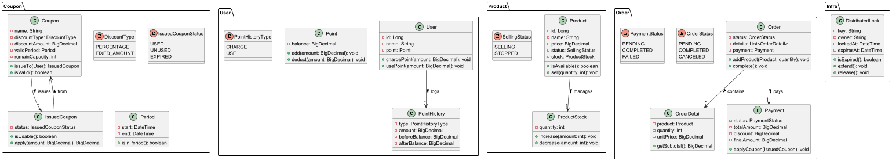
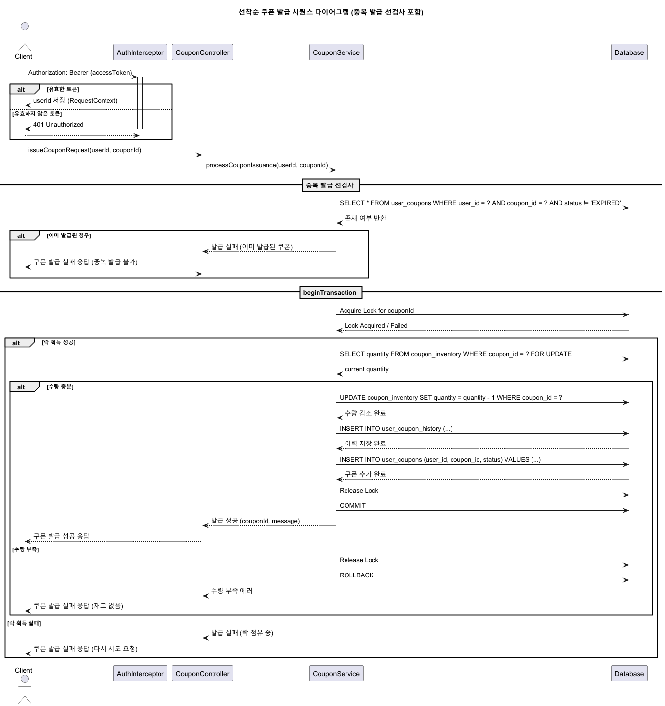

# 선착순 쿠폰 발급 이커머스 서비스

## 배경
이커머스 서비스에서 이벤트 또는 프로모션의 일환으로 선착순 쿠폰 발급 기능을 제공하고 있습니다. 최근 사용자 증가로 인해 짧은 시간 내에 많은 요청이 동시에 몰리면서 쿠폰의 초과 발급, 중복 발급과 같은 문제가 발생했습니다. 이를 해결하기 위해 정확한 선착순 관리와 동시 요청 처리 시 유량제어가 가능한 안정적이고 효율적인 쿠폰 발급 시스템을 구축하기 위해 본 문서를 작성하게 되었습니다.

[요구사항](docs/requirements.md)
---
- 사용자는 상품을 조회하고, 선택한 상품을 장바구니에 담거나 주문하며, 충전된 잔액을 이용하여 결제할 수 있습니다.
- 서비스는 판매량에 따른 인기 상품 추천 기능을 제공합니다.
- 정해진 수량의 선착순 쿠폰을 발급합니다.
- 구체적인 요구사항은 소제목을 클릭해 확인해주세요.


---
## 시스템 구성

### Context Diagram
```
User --> E-commerce System --> DB
```
### Component Diagram
```
[User] --> [Frontend] --> [API Gateway] --> [Coupon Service] --> [Coupon DB]
                                |
                                |--> [Order Service] --> [Order DB]
                                |
                                |--> [Point Service] --> [Point DB]
```
사용자는 프론트엔드를 통해 상품 조회, 장바구니, 주문, 쿠폰 발급 및 포인트 사용을 요청합니다. API Gateway는 요청을 적절한 서비스로 라우팅하며, 쿠폰 서비스는 쿠폰의 선착순 발급을 처리하고 DB와 연계하여 상태를 관리합니다.


## ERD

## Class Diagram


 [SequenceDiagram](docs/SequenceDiagram.md)
-----
- 구체적인 사항은 소제목을 클릭해 확인해주세요.

---

## 주요 기능 설명

### 선착순 쿠폰 발급 방식


선착순 쿠폰 발급 기능은 이벤트가 시작되는 특정 시점에 많은 사용자의 요청이 몰리는 것을 고려하여 다음과 같은 조건을 충족하도록 설계되었습니다.
- 정확한 수량 제한: 발행된 쿠폰은 정해진 수량을 절대 초과하지 않도록 관리합니다.
- 중복 발급 방지: 동일 사용자에게 중복 쿠폰이 발급되지 않도록 사용자 ID를 기반으로 체크합니다.
- 유량 제어: 높은 동시성 환경에서도 데이터 무결성을 보장하기 위해 락과 큐를 활용하여 동시 요청을 효율적으로 제어합니다.



