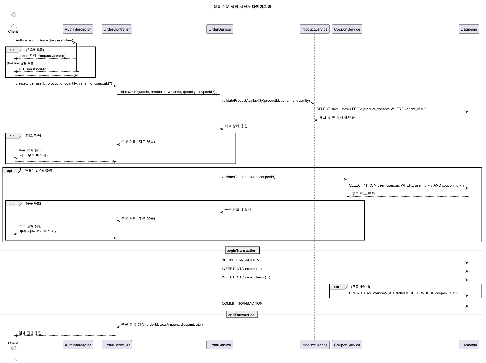

# 이커머스 서비스 시퀀스 다이어그램

---

## 1. 유저 개인 정보 관련

### 1.1. 포인트 충전

### 1.2. 보유 쿠폰 조회

### 1.3. 주문 조회

### 1.4. 포인트 조회

---

## 2. 상품 관련

### 2.1. 상품 조회

### 2.3. 인기 상품 조회

### 2.4. 인기 상품 산출 스케줄러

---

## 3. 주문 / 결제 관련

### 3.1. 포인트 결제

### 3.2. 상품 주문

### 3.3. 장바구니 주문

---

## 4. 쿠폰 관련

### 4.1. 쿠폰 발급

---

## 5. 장바구니 관련

### 5.1. 장바구니에 상품 추가

### 5.2. 상품 수량 변경

### 5.3. 장바구니 비우기

### 5.4. 장바구니 조회
