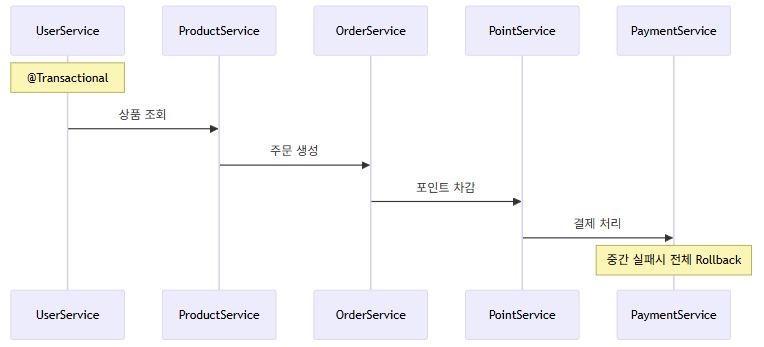
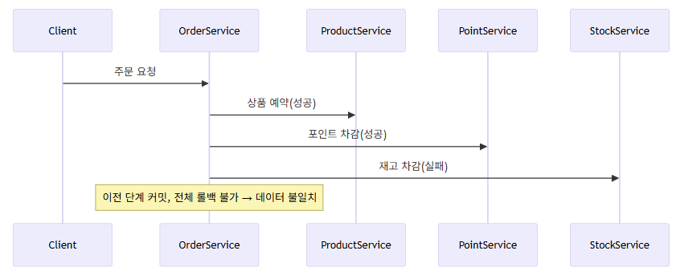
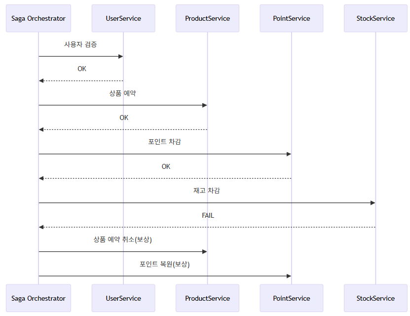
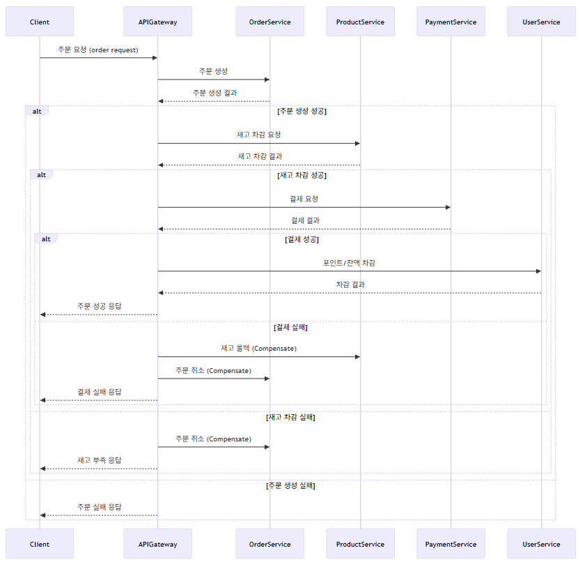

# 모놀리식 주문 시스템의 마이크로서비스 전환 설계

## 1. 배경
기존 시스템은 모든 기능이 하나의 애플리케이션에 통합된 모놀리식 아키텍처입니다.
이 구조는 개발·배포가 간편하고, 초기 운영에는 효율적이지만,
서비스가 성장하면서 다음과 같은 한계가 명확히 드러납니다.

- 전체 시스템 재배포: 사소한 변경에도 전체를 빌드·배포해야 하며,
장애 시 전 서비스에 영향이 전파됨
- 비효율적 확장: 특정 도메인(예: 상품, 결제) 부하가 급증해도
전체 시스템을 수직 확장해야 하므로 자원 사용 효율이 떨어짐
- 강결합: 도메인 간 강한 결합으로 인해 유지보수성, 개발속도,
장애 격리 모두 저하

비즈니스 민첩성, 안정성, 운영 효율성 확보를 위해
각 도메인을 독립적으로 분리하는 MSA 전환이 필요합니다.

## 2. 도메인별 배포 단위 설계 및 분리 논리
### 2.1 도메인별 설계 원칙
- 응집도: 함께 변경·배포되는 기능 묶음
- 결합도 최소화: 서비스 간 데이터/통신 독립
- 데이터 소유권 명확화: 각 서비스별 전용 DB
### 2.3 서비스별 분리 구조 및 기준
| 서비스       | 도메인                | 분리 근거 / 특징      |
| --------- | ------------------ |-----------------|
| User      | User, UserCoupon   | 인증/인가, 개인정보 일관성 |
| Product   | Product, Stock     | 읽기 집약, 재고 정합성   |
| Order     | Order, Payment     |  주문/결제 불가분, 높은 트랜잭션 |
| Point     | Point, Transaction |  금융 특화    |
| Promotion | Coupon             |  마케팅 정책 변경, 대량 발급   |
| Analytics | Rank, Statistics   |  대용량 집계, 배치 최적화     |

## 3. 분산 트랜잭션 처리의 한계
## 3.1 단일 트랜잭션과 분산 트랜잭션 차이
- 모놀리스 (단일 트랜잭션, Rollback 가능)

- MSA (분산 트랜잭션, 부분 성공/실패 발생)

  - 부분 성공/실패 발생 가능성 
  - 데이터 불일치(최종 일관성) 허용 필요 
  - 복잡한 보상 트랜잭션 필수(예: 재고예약 취소, 포인트 복원 등)

## 4. 해결 방안
### 4.1 Saga 패턴으로 원자성 보존

- 각 단계 실패 시 보상 트랜잭션 실행
- Dead Letter Queue 등으로 예외 추적
### 4.2 API Gateway Orchetrator로 UX 일관성 유지

- Gateway/Orchestrator가 각 서비스 호출을 순차 실행/모니터링
- 사용자에게는 일관된 결과와 상태만 반환
- 각 서비스는 “성공→다음, 실패→보상” 원칙 유지
### 4.3 Eventual Consistency & Outbox/Inbox로 정합성 확보
- Outbox 패턴: 트랜잭션 내에서 이벤트를 안전하게 저장(DB), 별도 프로세스가 publish
- Inbox 패턴: 외부 이벤트를 내 서비스 DB에 저장하고 처리 상태 관리
### 4.4 Idempotency Key로 중복 요청 방지
- 클라이언트/게이트웨이에서 Idempotency-Key(UUID) 부여
- 서버는 Redis 등으로 키 중복여부 체크 후, 중복요청시 기존 결과 즉시 반환

## 5. 실패 보상 전략 비교
| 전략            | 장점               | 단점/리스크        | 주요 사례               |
| ------------- | ---------------- | ------------- | ------------------- |
| 이벤트 리스너 기반 보상 | 서비스간 결합도 낮음, 확장성 | 비동기, 결과확정 지연  | OrderFailed → 재고 복구 |
| 동기 주문 취소 API  | 즉각 결과확정, 단순 디버깅  | 강결합, 타임아웃 위험  | 결제실패→주문취소 API       |
| UX 재시도/대체 흐름  | 로직 단순, UX 보완 용이  | 사용성 저하, 지표 악화 | “다시 결제” 버튼          |
| 보상 쿠폰 발행      | 사용자 만족/전환율 확보    | 비용, 악용 가능     | 품절→쿠폰 자동지급          |
| SAGA 보상 트랜잭션  | 전체 일관성/확장성 확보    | 분산설계/테스트 복잡   | 재고↓→결제→잔액→역순복구      |
